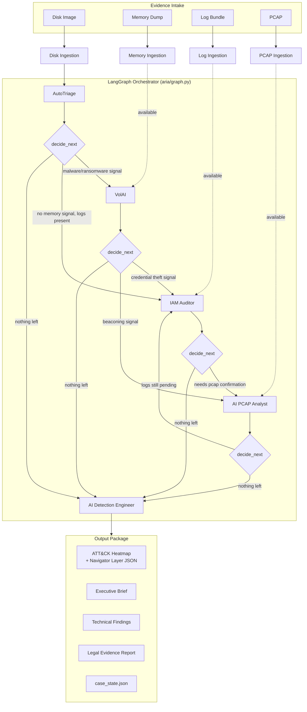

# ARIA — Autonomous Response & Investigation Agent

**One command. Four evidence sources. A complete incident response report package.**

writeup: https://www.cybersecbella.com/articles/aria/

```bash
aria investigate \
  --case-name "Northshore Clinic Ransomware" \
  --disk    data/sample_incident/disk_manifest.json \
  --memory  data/sample_incident/memory_manifest.json \
  --logs    data/sample_incident/log_manifest.json \
  --pcap    data/sample_incident/pcap_manifest.json \
  --analyst "YOUR NAME" \
  --out     examples/output
```

ARIA ingests a disk image, a memory dump, a log bundle, and a packet capture,
then runs an **AI-orchestrated investigation** — deciding for itself which
specialist tool to run next based on what the previous tool found — and
produces three audience-specific reports plus a MITRE ATT&CK heatmap of
everything it observed.

## Why this exists

IR consulting firms (Mandiant, Kroll, PwC, and the rest of the Big 4/Big 5
IR practices) bill $300–500/hr for exactly this workflow: pull a disk image
and a memory dump, correlate them against logs and network traffic, write
three different reports for three different audiences, and map it all to
ATT&CK. That process today is mostly manual and takes days.

ARIA automates the triage-and-correlation phase of that workflow:

- **IR consulting firms** get a force multiplier — junior analysts can run a
  first-pass investigation in minutes instead of days, freeing senior staff
  for judgment calls and client communication.
- **In-house IR teams at banks and hospitals** get faster time-to-report
  when every hour of dwell time matters and regulatory clocks are running.
- **This is a fundable wedge into a VC-backed category** (IR automation /
  "AI SOC analyst") — ARIA demonstrates the orchestration and reporting
  layer; the ingestion modules are built to swap in real forensic engines
  (see [Production Readiness](#production-readiness) below).

## What makes this an *agent*, not a pipeline

Most "AI forensics" demos run a fixed sequence: parse disk, then memory,
then logs, then pcap, always in that order, every time. ARIA doesn't. It's
built on [LangGraph](https://github.com/langchain-ai/langgraph), and after
every tool runs, an orchestrator function inspects the **signals** that tool
left behind and picks whichever remaining tool is highest priority given the
evidence so far:

- No malware indicators on disk? ARIA may never touch the memory dump.
- Memory analysis finds LSASS credential access? ARIA prioritizes the IAM
  Auditor over a routine PCAP pass, because credential theft usually means
  someone used those credentials.
- No PCAP provided at all? ARIA routes around it and still produces a full
  report from whatever evidence exists.

Two cases with identical CLI arguments but different evidence contents can
take entirely different paths through the graph. The full reasoning trail
is preserved in `state["decision_log"]` and printed in every technical and
legal report.

## Architecture



See [ARCHITECTURE.md](ARCHITECTURE.md) for a module-by-module breakdown.

### The five tools ARIA orchestrates

| Tool | Role | Runs on |
|---|---|---|
| **AutoTriage** | First responder — finds dropped malware, ransom notes, timestomping, execution evidence | Disk image |
| **VolAI** | Memory forensics — process trees, LSASS access (credential dumping), injected code, live network connections | Memory dump |
| **IAM Auditor** | Identity review — impossible-travel logins, over-privileged service accounts, mailbox rule tampering | Logs (Windows Event Log, Azure AD, O365 audit) |
| **AI PCAP Analyst** | Network analysis — confirms C2 on the wire, JA3/SNI anomalies, abnormal internal transfer volume | Packet capture |
| **AI Detection Engineer** | Correlates every finding above into an attack narrative and drafts Sigma-style detection rules | All accumulated findings |

## Quickstart

```bash
git clone https://github.com/cybersecbella/aria.git
cd aria
pip install -r requirements.txt
PYTHONPATH=. python -m aria.cli investigate \
  --case-name "Demo Incident" \
  --disk data/sample_incident/disk_manifest.json \
  --memory data/sample_incident/memory_manifest.json \
  --logs data/sample_incident/log_manifest.json \
  --pcap data/sample_incident/pcap_manifest.json \
  --analyst "Your Name" \
  --out examples/output
```

This runs ARIA against a bundled **synthetic sample incident** (a
ransomware + credential-theft scenario at a fictional healthcare org — see
`data/sample_incident/`) and writes a full report package to
`examples/output/<case-id>/`:

- `executive_brief.md` — plain-language, board-ready summary
- `technical_findings.md` — full finding detail, ATT&CK mappings, orchestration trail, drafted Sigma rules
- `legal_evidence_report.md` — chain of custody, hash inventory, conservative findings language, examiner attestation block
- `attck_heatmap.html` — standalone visual heatmap, no dependencies
- `attck_navigator_layer.json` — drop straight into [MITRE ATT&CK Navigator](https://mitre-attack.github.io/attack-navigator/)
- `case_state.json` — the full machine-readable case state, for downstream tooling

Run the smoke tests:

```bash
PYTHONPATH=. python tests/test_investigation.py
```

## Production readiness

This repository demonstrates the **orchestration and reporting layer** —
the part of the workflow that's genuinely hard to get right (adaptive
routing, cross-tool correlation, audience-specific report generation,
ATT&CK mapping). To keep it runnable anywhere with zero external
dependencies and no raw forensic binaries required, the four ingestion
modules (`aria/ingestion/*.py`) currently read **pre-extracted JSON
manifests** rather than parsing raw disk images, memory dumps, or packet
captures directly.

Every ingestion module documents its production swap-in point:

| Module | Demo mode | Production backend |
|---|---|---|
| `aria/ingestion/disk.py` | Reads a JSON manifest | The Sleuth Kit / `pytsk3`, `dfvfs` |
| `aria/ingestion/memory.py` | Reads a JSON manifest | Volatility 3 (pslist, malfind, ldrmodules, handles, netscan) |
| `aria/ingestion/logs.py` | Reads a JSON manifest | `python-evtx` / Chainsaw + Azure AD / Okta sign-in log APIs |
| `aria/ingestion/pcap.py` | Reads a JSON manifest | Zeek + Suricata, or `pyshark`/`scapy` for targeted extraction |

Because every downstream tool (`aria/tools/*.py`) consumes the *normalized*
output of ingestion rather than raw artifacts, swapping a demo ingestion
module for a production one requires no changes to orchestration, reporting,
or the ATT&CK heatmap.

The LangGraph orchestration itself (`aria/graph.py`) is written against the
real `langgraph.graph.StateGraph` API and installs it as a normal
dependency. A small compatibility shim (`aria/_graph_compat.py`) implements
the same interface for environments where installing `langgraph` isn't
possible, so the orchestration logic never has to change based on which one
is active.

## Roadmap

- [ ] Real Volatility3 / TSK / Zeek backends behind the existing ingestion interfaces
- [ ] LLM-authored narrative sections in the executive brief (currently template-driven from structured findings)
- [ ] Multi-host / multi-image case support (current graph runs one artifact set per tool)
- [ ] PDF/DOCX export of the three report formats
- [ ] Native MITRE ATT&CK Navigator hosting instead of static layer export

## Disclaimer

The bundled sample incident is entirely synthetic. The legal evidence report
format is a **template exhibit** and does not constitute legal advice; have
counsel review any report before external production. ARIA's analysis is
AI-assisted and is intended to accelerate, not replace, examiner judgment.

## License

[MIT](LICENSE)
